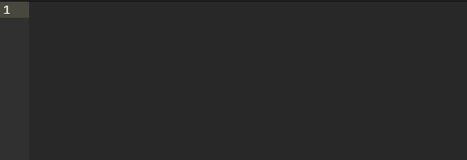

# Selector to Tag 

Selector to Tag is an Atom editor package that allows you to create HTML tag elements using CSS selectors in HTML files.

Just type a CSS selector and press `TAB`:

## Options

 - **File extensions** - comma separated file extensions in which this package should be active *(Default: "htm, html, kit, shtml, tmpl, tpl, xhtml")*

 - **Solve Tags** - this will indicate if this package should also solve tags when there is no id or class specified. When this is activated it will basically override the default `html-language` package, so you could disable that package. *(Default: true)*

## Supported selectors

For now the following selectors
 - tag
 - \#id
 - .class

If you have any sugesstions for other selectors or sugestions in general, please submit an issue.
